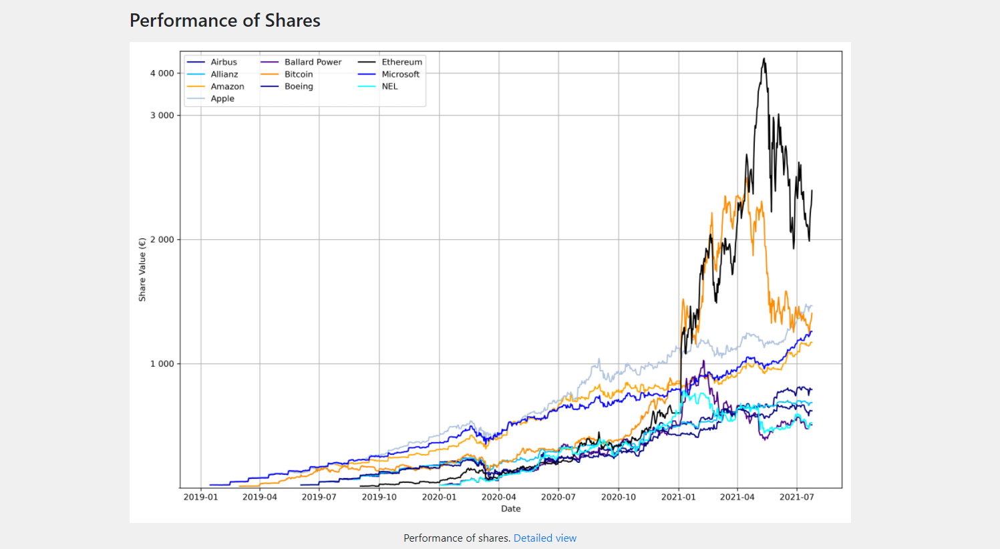
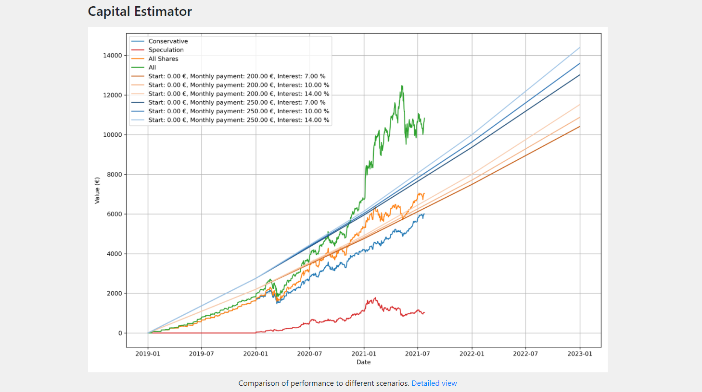
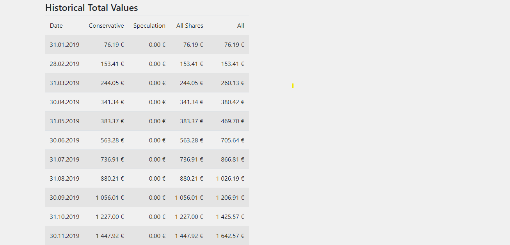
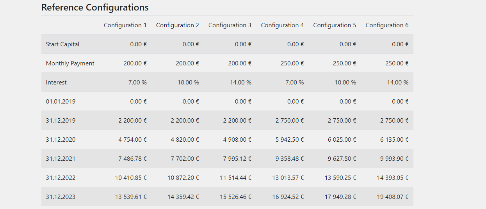
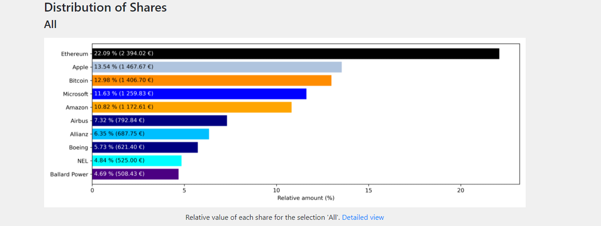
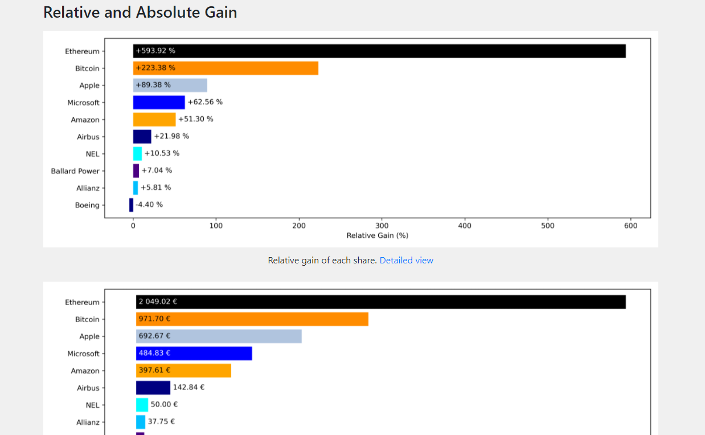
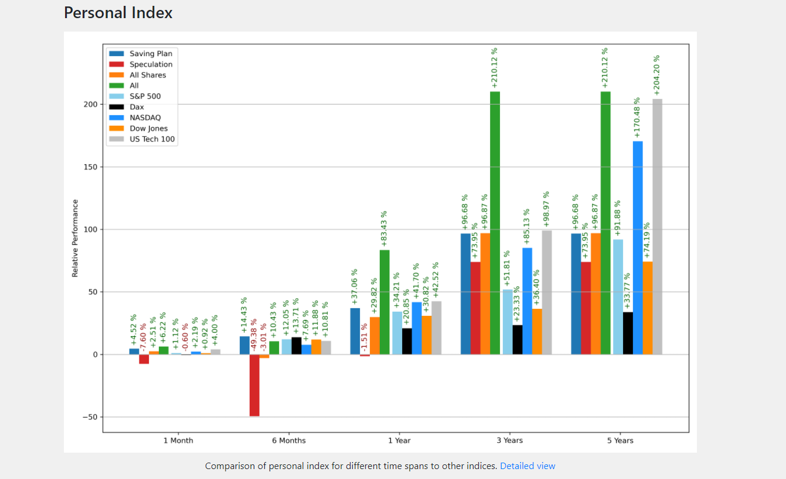
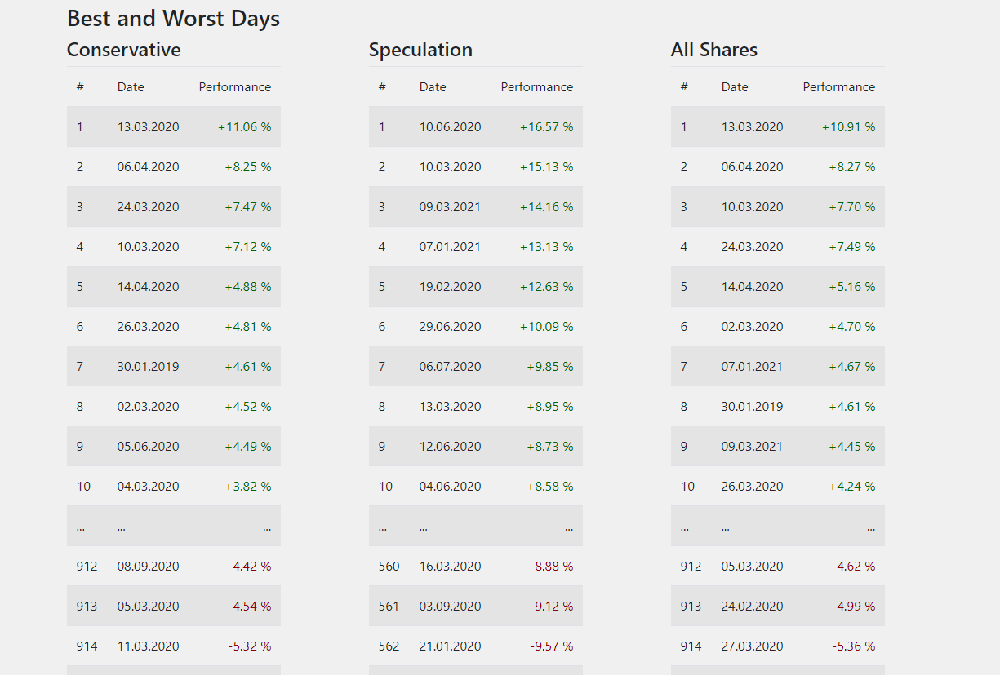

Introduction
############

With the Capital Analyzer it is possible to analyze the evolution of the 
shares that one posseses. Furthermore, the performance can be evaluated
and compared to reference indices.

The tool will create an html-page, which consist of the following sections.

Performance of Shares
+++++++++++++++++++++

In this section, the evolution of each single share is shown. 

    
    Example Result of the Performance of Shares.

In order to create this graph, for each day and for each share the amout is
determined and multiplided by the closing value at this day. This gives the
value for each share.

.. note::
    At the moment, this tool works only with one currency. Therefore, for
    consistent results, it is important to download the data all in the
    same currency.
    

For the y-axis, the numpy symlog scaling is used. This means, that in the
range between 0 and 3000, a linear axis is used. For the values above
3000, a logarithmic scale is used. This allows to show shares of different
amounts in one graph.

Capital Estimator
+++++++++++++++++

In this section, the evolution of the total value is compared to a reference
configuration.

    
    Comparison of the evolution of the total value to custon reference configurations.

For the reference configuration, a simple model is assumed. There exist three
parameters:

    - the start capital,
    - the monthly payment, and
    - the interest rate.
    
The evolution of the capital of the reference evolution within one year is
calculated using the following formula: $K_{n+1} = K_n * (1+i) + 12*m$,
where $K_n$ is the capital at the start of the year, $K_{n+1}$ is the
capital at the end of the year, $i$ is the interest rate, and $m$ is the
monthly payment. It is therefore assumed, that the interest rate is
the same for every year. Therefore, it should not be taken too high. 
A relalistic value is about $7\% - 9\%$, which is approximatey the average
interest rate of the Dow Jones.

For the comparison, different reference configurations can be defined.
This evolution is compared to the evolution to the total value. A special
feature is, that different shares can be combined into different categories.
In the example aboce, the blue lines shows the evolution of all shares,
which were categorized as conservative. The red line shows the evolution
of shares, which were categoried as speculative, as these share belong
to the high volative sector of fuel cell technology. The orange
line shows the sum of the before mentioned lines and shows the evolution
of all shares. Furthermore, in this demo configuration, a saving plan
for cryptocurrencies was established. Therefore, combining the total value
of all assets results in the green line.

The grouping of shares lies in the hand of the user and can be done
differently. It is also possible to show only the green line.

The goal is now to keep the line showing the total value of all
assets above the line of the reference configurations. If this stays
to the end of the investment period, than a certain amount can be reached at
least (see below).

Historical Total Values
-----------------------

In this table, the the total values at the end of each month are listed.
For this table, the same grouping as above is applied.

    
    Historical Total Values Table.

The last row of this table shows the total values for the last calculated day.

Reference Configurations
------------------------

In this table, the evolution of the reference configurations is shown.
For each configuration, the theoretical capital at the end of each year is 
shown.

    
    Values of the Reference Evolutions at the End of each Year.

Distribution of Shares
++++++++++++++++++++++

In this section, the distributions of the shares is shown. Again, the same 
grouping from above is applied.

    
    Distribution of Shares.

With these charts it is possible to check, if there is one share, that is
overweighted. In these graphs it is also possible to see the absolute
values of each share.

Relative and Absolute Gain
++++++++++++++++++++++++++

In this section, the relative and absolute gain of each share is shown.

    
    Relative and Absolute Gain.
    
Here, no categories are considered, since the gain is individual to the
share.

.. note::
    These values can sometimes be inaccurate. For example, when creating
    a spin off, shares of the new company will be added to the portfolio.
    These shares have a buy price of 0. Therefore, in this case no relative
    gain can be calculated. Furthermore, the value of the mother company
    decreases by the amount of the new issued shares. This means, that in
    this graph, the shares of the mother company might be listed at a loss,
    even though no loss was made at all.
    
.. note::
    Another problem occurs, if shares are sold and bought immediately. This
    can e.g. be done in order to save taxes. However, this has an effect
    on the average buy price and therefore on the relative and absolute
    gains.
    

Personal Index
++++++++++++++

With the personal index, the development of the personal portfolio can be
compared to reference indices. This comparison in done for timespans (like
3 months, 6 months, ...) and the last 5 years.

    
    Personal Index.

The calculation is based on the performance of each single day. For this,
the values $K1_i$ and $K2_i$ are calculated for the day $i$. The value $K1$ is 
the sum of the capital at the previous day and the amount which was used to buy
new shares. The value $K2$ is consists of the capital at the end of the day
(based on the closing value) minus the amount that was obtained from selling
shares. Using these two values, the daily performance can be calculated as
$p_i = \frac{K2_i}{K1_i}$.

The performance of a given timespan is obtained by multiplying the
daily performances of all days within that timespan: 
$p_{ts} = p_i \cdot p_{i+1} \dots$

For the personal index, a grouping can be performed as well. However, this
grouping might be different than used for the capital estimator. Furthermore,
the user can select custom reference indices, which will also be plotted.

Best and Worst Days
+++++++++++++++++++

Based on the personal index, the relative performance is evaluated
at each day. In this table, the 10 best and 10 worst days are shown, again
using the categories that were defined for the personal index.

    
    Best and Worst Days.
    

