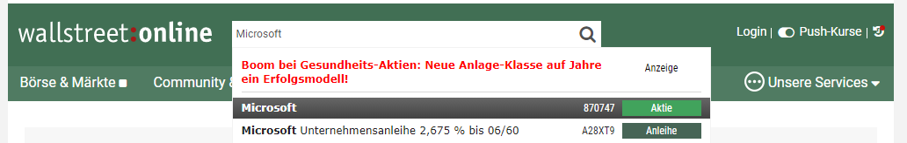
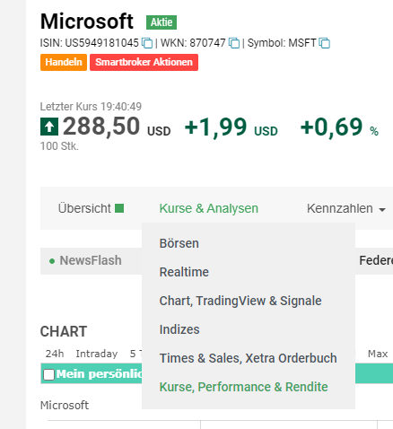
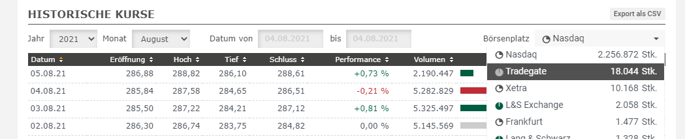
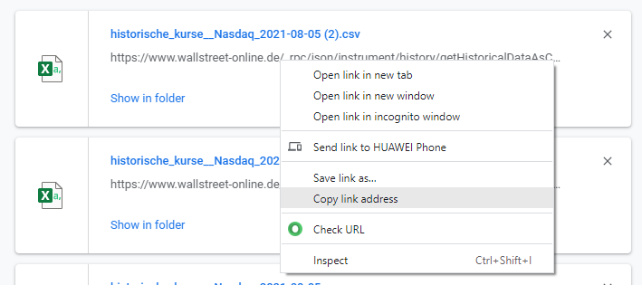
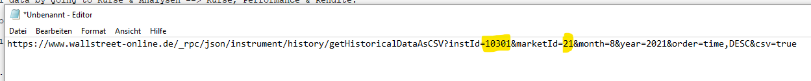
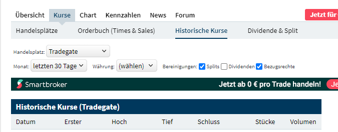
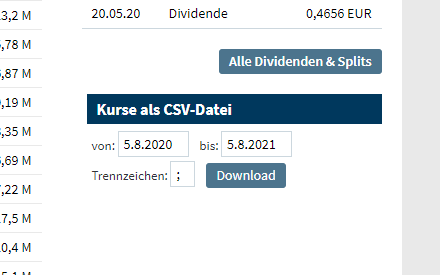
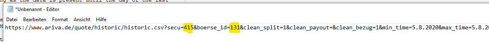
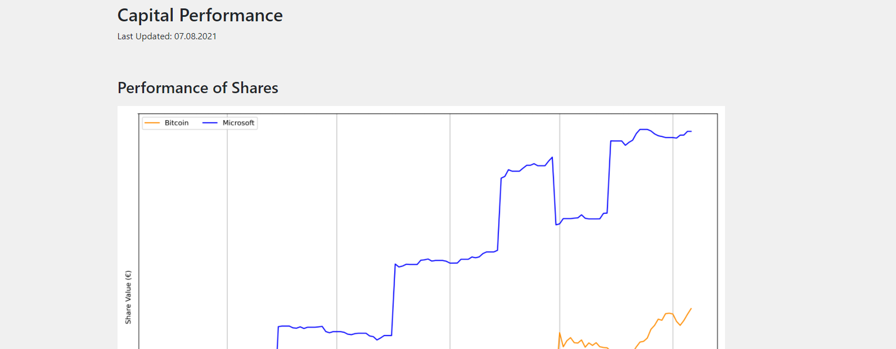

Tutorial
########

Before using the full potential of the Capital Analyzer, first some
manual configuration must be done. This tutorial shows, which steps need
to be performed.

Demo Configuration
++++++++++++++++++

In the directory ``capital_analyzer/demo_config`` a fully configured
demo configuration can be found. This example can be used as a template
for the own configuration.

Preparation
+++++++++++

In order to create a custom configuration, it is advisable to create a
complete new directory. In this example, this directory will be called 
``tutorial``. It can be placed everywhere on the hard drive.

Go to the directory ``capital_analyzer`` and copy the directory ``html``. Paste
it into the newly created directory ``tutorial``. Your directory should now
look as follow:

.. code::

    - tutorial (dir)
        |- html (dir)
        |   |- bootstrap (dir)
        |   |   |-  <content for bootstrap>
        |   |- index_template.html
        |   |- jquery-3.4.1.min.js
        |   |- main.css
        |   |- main.js
        

Prepare Share Data
++++++++++++++++++

The first step is to prepare the share data dictionary. This dictionary
contains the information, from where to download the share values and
also the style and category informations.

For this, in the directory ``tutorial`` create a file ``share_data.py`` and
paste the following content:

.. code:: python

    # -*- coding: utf-8 -*-
    """
    Module to define the share data.
    """

    def get_share_data_dict():
        """
        Returns the dictionary containing the share data.
        """
        
        share_data_dict = {}

        # fill data here

        return share_data_dict

    def get_split_list():
        """
        Returns the data for the share splits.
        """
        
        split_list = []
        
        return split_list

Your directory should now look as follow:

.. code::

    - tutorial (dir)
        |- html (dir)
        |   |- bootstrap (dir)
        |   |   |-  <content for bootstrap>
        |   |- index_template.html
        |   |- jquery-3.4.1.min.js
        |   |- main.css
        |   |- main.js
        |- main_downloader.py
        |- share_data.py

The function ``get_share_data_dict`` return a dictionary containing the
details of each share (like displayname, color, or download data). 
The functio ``get_split_list`` will return a list of all splits of shares
to consider. In this tutorial, no splits are considered, hence this function
will not be modified.

In the following, the dictionary ``share_data_dict`` will be filled
with details.

Create Dictionary Entry
-----------------------

In the first step, create a dictionary entry for the share. The key
can be chosen arbitrarly, but must be unique. For example, the ISIN, WKN, or
the symbol can be used, as these are unique to each share. In this example, 
the WKN (Wertpapierkennnummer) is used. For this example, the details for the
Microsoft share is added. It has the WKN ``870747``:

.. code:: python

    share_data_dict["870747"] = {
    
    }
    
Add Displayname, Color, and Category
------------------------------------

The first entries will be the displayname (which will be shown in the legend),
the color (which will be used for the lines and bars), and the category
(which will be used for the grouping).

.. code:: python

    share_data_dict["870747"] = {
        "displayname": "Microsoft",
        "color": "b",
        "category": [
            "A"
        ],
    
    }
    
The displayname can be chosen arbitrarly, here also duplicated to other
entries are possible (e.g. for shares that were splitted). For the
color, every valid matplotlib color can be entered 
(see `matplotlib documentation <https://matplotlib.org/stable/gallery/color/named_colors.html>`_).
It is also possible to enter a RGB-value-tripple. In this case it is 
important to enter the values between 0 and 1.

In the field ``category``, the respective categories are listed. A share
can belong to more than one category. The categories are identified
by a unique id, which again can be chosen arbitrarly. For example,
``"A"``, ``"category_1"``, ``"crypto"`` ... can be possible
identifiers. In the example, this share will be in category ``"A"``,
which will be a category for a conservative choise.

There exist two already predifined categories. Category ``"K"`` is used
to categorize knock outs and other derivatives. Category ``"X"`` is used
to categorize the reference indices, to which the personal index is 
compared.
    
.. note::
    An example for a share, that belongs to two categories, could be Knock-Outs.
    One might put them in a speculative category with other speculative
    assets (e.g. shares from fuel cell or cannabis sector). These shares
    should also be categorized into category ``"K"``, since in a future
    update these derivatives will be evaluated as well.
    
    
Add Download Data
-----------------

For the evaluation, the historical data must be downloaded first. Therefore,
the required details must be added.

For now, two sources of historical data are supported: 
`Wallstreet Online <https://www.wallstreet-online.de/>`_ and 
`Ariva <https://www.ariva.de/>`_.

**Wallstreet Onlinle**: To gather the required data, first open the website
`https://www.wallstreet-online.de/ <https://www.wallstreet-online.de/>`_. Then,
go to the site of the respective share.

    
    Search Share at Wallstreet Online.

Then, open the historical data by going to Kurse & Analysen --> Kurse, Performance & Rendite.

    
    Find Historical Data.
    
Then, select the stock exchange place, at which you usually trade 
(e.g. ``Tradegate``).

    
    Select Stock Exchange Data.
    
Then, click on ``Export als CSV``. This will download the historical data
of the current selection. The downloaded .csv file is actually not of 
importance. Important here is the download link. For this, go to your
browser menu, and open the Download menu. There, the downloaded file is
listed. Hover with your mouse over the linke and select ``Copy Link Address``.

    
    Copy Link Address.
    
Open your default text editor and paste the link. There, you will
see the html-link do download the data. The important fields are
``instId`` and ``marketId``.

    
    Extract data.
    
This information can now be added into the ``share_data_dict`` entry. For this,
a new dictionary with the key ``download_dict`` will be added.

.. code:: python

    share_data_dict["870747"] = {
        "displayname": "Microsoft",
        "color": "b",
        "category": [
            "A"
        ],
        "download_dict": {
            "data_service": "wo",
            "download": 1,
            "instId": "10301",
            "marketId": "21"
        }
    }

It contains four entries. With the entry ``data_service``, the source
of the data is defined (Wallstreet Online or Ariva). Use ``"wo"`` here to
set the source to "Wallstreet Online". 

With the entry ``download``, the 
download of the data can be enabled (``1``) or disabled (``0``). For example,
if all shares of a given company are sold, then it is no longer required to
download the data (as long as the data is present until the day of the last
sell).

The following two entries ``instId`` and ``marketId`` are the ones obtained
from the download link. Make sure, that these values are pasted as a string!

**Ariva**: Sometimes, not all shares are available at Wallstreet Online. 
Therefore, a second source is supported.

The steps to perform are similar to the steps for Wallstreet Online. First,
go to `https://www.ariva.de/ <https://www.ariva.de/>`_ and open the
site of the share. Then go to Kurse --> Historische Kurse and select
the stock exchange.

    
    Historical Data of Ariva.
    
Scroll down to the section "Kurse als CSV-Datei" and click the "Download" 
button.

    
    Download Historical Data.

Open the Download window of your browser, copy the link of the downloaded
file and paste it into a text editor. Here, the fields "secu" and "boerse_id"
are important. 

    
    Ariva Download Link.

Now, similar to Wallstreet Online, this information
can be added. For the field ``data_service`` use ``"ariva"``.
    
.. code:: python

    share_data_dict["870747"] = {
        "displayname": "Microsoft",
        "color": "b",
        "category": [
            "A"
        ],
        "download_dict": {
            "data_service": "ariva",
            "download": 1,
            "secu": "415",
            "boerse_id": "131"
        }
    }

.. note::
    You must add the details from only one service, not both.
    
    
This process must be repeated for each share to consider. If you buy a new
share, don't forget to add this share to this dictionary!

Add the following entry for Bitcoin.

.. code-block:: python

    share_data_dict["BTC"] = {
        "displayname": "Bitcoin",
        "color": "darkorange",
        "category": [
            "crypto"
        ],
        "download_dict": {
            "data_service": "ariva",
            "download": 1,
            "secu": "111697700",
            "boerse_id": "163"
        }
    }
    

For comparison, the performance of the personal portfolio will be compared
to the performance of the MSCI World. for this, add the following
entry to the dictionary. Category ``'X'`` denotes, that this
entry is used for comparison.

.. code-block:: python

    share_data_dict["msci_world"] = {
        "displayname": "MSCI World",
        "color": "lightblue",
        "category": [
            "X"
        ],
        "download_dict": {
            "data_service": "ariva",
            "download": 1,
            "secu" : 226974,
            "boerse_id": "173"
        }
    }

    
    
Download Share Data
+++++++++++++++++++

In the next step, the historical data for each share is downloaded. For this,
create a new file ``main_downloader.py`` with the following content:

.. code-block:: python

    """
    Main Downloader module.
    """

    from capital_analyzer.download_data import download_data

    from share_data import get_share_data_dict

    def demo_download_data():
        """
        Method to download the historical share data.
        """
        
        share_data_dict = get_share_data_dict()
        
        download_data(share_data_dict)
        
        
    if __name__ == "__main__":
        demo_download_data()
        

Your directory should now look as follow:

.. code::

    - tutorial (dir)
        |- html (dir)
        |   |- bootstrap (dir)
        |   |   |-  <content for bootstrap>
        |   |- index_template.html
        |   |- jquery-3.4.1.min.js
        |   |- main.css
        |   |- main.js
        |- main_downloader.py
        |- share_data.py
        
Run this file in order to download the historical data.

.. note::
    This script should be run each day before evaluating the trades.
    
Your directory should now look as follow:

.. code::

    - tutorial (dir)
        |- data (dir)
        |   |- share_data (dir)
        |   |   |- wkn_870747_historic.csv
        |- html (dir)
        |   |- bootstrap (dir)
        |   |   |-  <content for bootstrap>
        |   |- index_template.html
        |   |- jquery-3.4.1.min.js
        |   |- main.css
        |   |- main.js
        |- main_downloader.py
        |- share_data.py
        
  
Create File with all Trades and Dividends
+++++++++++++++++++++++++++++++++++++++++

In the next step, all trades will be collected into one file. For this,
create a new file ``trades.py`` with the following content:

.. code-block:: python

    # -*- coding: utf-8 -*-
    """
    File containing the list of trades and dividends.
    """

    from datetime import datetime

    def get_trades():
        """
        Returns a list of trades.
        """
        list_trades = []
    
        return list_trades

    def get_dividends():
        """
        Returns a list of dividends.
        """
        
        #dividends
        list_dividends = []
        
        return list_dividends

Your directory should now look as follow:

.. code::

    - tutorial (dir)
        |- html (dir)
        |   |- bootstrap (dir)
        |   |   |-  <content for bootstrap>
        |   |- index_template.html
        |   |- jquery-3.4.1.min.js
        |   |- main.css
        |   |- main.js
        |- main_downloader.py
        |- share_data.py
        |- trades.py

The function ``get_trades`` will return the list of all trades. The
entries the list are a tuple consisting of the following items:

    - date of purchase / sell,
    - identifier of the share,
    - amount of shares bought /sold,
    - total amount of money paid (with fees) / obtained (without fees),
    - fees (optional).
    
An example entry might look like this:

.. code-block:: python

    list_trades.append((datetime(2021,  3,  15), "870747",       0.12470,    25.00,   0.44))  # buy
    list_trades.append((datetime(2021,  4,   1),    "BTC",    0.00030281,    15.00,   0.00))  # buy
    list_trades.append((datetime(2021,  4,  15), "870747",       0.11332,    25.00,   0.44))  # buy
    list_trades.append((datetime(2021,  5,   1),    "BTC",    0.00031381,    15.00,   0.00))  # buy
    list_trades.append((datetime(2021,  5,  17), "870747",       0.12181,    25.00,   0.44))  # buy
    list_trades.append((datetime(2021,  6,   1),    "BTC",    0.00050002,    15.00,   0.00))  # buy
    list_trades.append((datetime(2021,  6,  15), "870747",       0.11515,    25.00,   0.44))  # buy
    list_trades.append((datetime(2021,  6,  30), "870747",      -0.10000,   -22.45,   0.40))  # sell
    list_trades.append((datetime(2021,  7,   1),    "BTC",    0.00048418,    15.00,   0.00))  # buy
    list_trades.append((datetime(2021,  7,  15), "870747",       0.10323,    25.00,   0.44))  # buy
    
If shares are bought, then the amount of shares, total amount paid, and the
fees are all positive. If shares are sold, then the amount of
shares and the total amount paid are negative, but the fees are still positive.

In the next step, the dividends must be entered. Here, the same scheme is
applied. To maintain consistency of the indices of the tuple, here
an amount must be entered as well. For dividends, this amount must
be 0. Again, the amount of money obtained must be negative.

.. code-block:: python

    list_dividends.append((datetime(2021,  5,  19), "870747",       0.00000,   -0.14,   0.02))  #buy

If all trades are inserted, then this file is completed. After each purchase
or sell, an entry must be made in this file.

Create Main File
++++++++++++++++

In the final step, the main file must be created. When running this file,
the analysis is performed and the respective html-file is created.
Therefore, create a new file ``my_main.py`` with the following content:

.. code-block:: python

    # -*- coding: utf-8 -*-
    """
    Main File to run the analysis.
    """

    from datetime import datetime

    import site
    site.addsitedir("../python")

    from capital_analyzer.analyze_trades import run_analyze

    from trades import get_trades, get_dividends
    from share_data import get_share_data_dict

    def analyze_trades_demo():
        """
        Main function to run the analysis.
        """
        
    if __name__ == "__main__":
        analyze_trades_demo()
        
        
Your directory should now look like this:
    
.. code::

    - tutorial (dir)
        |- html (dir)
        |   |- bootstrap (dir)
        |   |   |-  <content for bootstrap>
        |   |- index_template.html
        |   |- jquery-3.4.1.min.js
        |   |- main.css
        |   |- main.js
        |- main_downloader.py
        |- my_main.py
        |- share_data.py
        |- trades.py

The configuration is now made in the function ``analyze_trades_demo``.

Basic Parameters
----------------

First, some parameters must be defined.

.. code-block:: python

    def analyze_trades_demo():
        """
        Main function to run the analysis.
        """

        # set some configuration files
        dir_path_out_html = r"./html"
        dir_name_images = "images"
        f_name_html = "index.html"

        lin_thresh = 3000
        currency = "€"
        
        # ...

With ``dir_path_out_html`` it is possible to set the path to the directory,
where the html file will be created. Within this directory, a new directory
will be created, where all the images are stored. The name of this
directory can be set with the variable ``dir_name_images``. Finally,
with ``f_name_html`` the name of the resulting html-file is defined.

.. note::
    With the parameters ``dir_name_images`` and ``f_name_html`` it is possible 
    to have the results of 2 different configurations in one single directory
    (for example your portfolio and the portfolio of your parents).
    Just select for each configuration a different value for both variables.

With the variable ``lin_thresh``, the symlog scaling of the y-axis can be
adjusted. Until the selected value, a linear scale is used, above this value,
a logarithmic scale is used. Finally, with the variable ``currency`` it is
possible to define the currency.

.. note::
    At the moment, it is only possible to have one currency. If you have
    assets that are only traded in another currency, you must create a new
    configuration.
    
Get Data
--------

In the next step, the share data, trades, splits, and dividends are loaded.

.. code-block:: python

    # 1. get data
    list_trades = get_trades()
    list_dividends = get_dividends()
    share_data_dict = get_share_data_dict()
    split_list = get_split_list()

Grouping for Comparison to Reference Configurations
---------------------------------------------------

In the next step, the groups for the comparison to the reference 
configurations are defined.

.. code-block:: python

    #-------------------------------------------------------------------------#
    # create a list of all categories to compare
    # each entry is a dictionary with the following keys:
    #    - 'category_list': list of categories to include. Can also be 'all'
    #      include every share
    #    - 'displayname': Displayname of the selection
    #    - 'color: color of the line. Use a matplotlib compatible color
    #      (see https://matplotlib.org/stable/gallery/color/named_colors.html)
    # This list will be used to plot the evolution of each selection (in the
    # section 'Capital Estimator')
    category_compare_list1 = []
    category_compare_list1.append({'category_list': ['A'],
                                   'displayname': "Conservative",
                                   'color': "tab:blue"})
    category_compare_list1.append({'category_list': ['crypto'],
                                   'displayname': "Crypto Currencies",
                                   'color': "tab:orange"})
    category_compare_list1.append({'category_list': "all",
                                   'displayname': "All",
                                   'color': "tab:green"})

In this tutorial, only one share is considered, both groups will give the
same values. But in order to demonstrate the capabilites, both groups
are defined.

.. note::
    It is theoretically possible to define any number of groups. But the number
    of groups should be limited, otherwise the graphs will not be useful.

Grouping for the Personal Index
-------------------------------

In the next step, the groups for the personal index are defined. Here, the
same fiels are required as above. Furthermore, it is possible to
use the same grouping (which is done here).
    
.. code-block:: python

    #-------------------------------------------------------------------------#
    # create a list of all categories to compare
    # entries are the same as above
    # This list will be used to compare an index-based performance. This
    # enables a comparison of the performance to the market performance.
    # See section 'Personal Index'
    category_compare_list2 = category_compare_list1
    
Define Reference Configurations
-------------------------------

In the next step, the reference configurations must be defined. First, the
start date and end date of the reference configurations must be defined.
The start date can be chosen as the day of the first trade. The end date
could e.g. be the expected day of pension.

.. code-block:: python

    #-------------------------------------------------------------------------#
    # Define some reference configurations to compare your performance
    # again a theoretical performance. If you are above the theoretical
    # performance, then you can predict your final outcome
    # the model of the theoretical evolution is quite simple. Define a 
    # start capital, a monthly payment and a yearly interest rate. It 
    # is assumed, that the capital will grow with this interest rate every
    # year. If taking an average interest rate (e.g. 7%), this will give
    # reasonable results.
    start_date_reference_config = datetime(2021, 3, 1)
    end_date_reference_config_table = datetime(2062, 2, 17)

Next, the reference configurations must be defined in a list. For each reference
configuration, the start capital, the monthly payment, the interest rate,
and the start date of the reference configuration must be defined.
It is also possible to define different reference configurations with different
start dates. Furthermore, a color for the plot must be selected.

.. code-block:: python

    reference_config_list = []
    reference_config_list.append({
        'args': {
            'start_capital' : 0,
            'monthly_payment' : 25,
            'interest' : 1.07,
            'start_date' : start_date_reference_config
        },
        'color': (197 / 255, 90 / 255, 17 / 255)
    })
    reference_config_list.append({
        'args': {
            'start_capital' : 0,
            'monthly_payment' : 25,
            'interest' : 1.10,
            'start_date' : start_date_reference_config
        },
        'color': (244 / 255, 177 / 255, 131 / 255)
    })

In this example, two reference configurations were defined. Both have the same
start capital of 0 and monthly payment of 25€. In the first case, an
interest rate of 7% annually is assumed. In the second case, this interest rate
is assumed to be 10%

Now, even more reference configurations can be defined. But for this example,
these two configurations should be sufficient.

Define Groups for Relative and Absolute Share Amounts
-----------------------------------------------------

Now, the groups for the relative amount must be defined. Here, the same
list as prevously defined can be used.

.. code-block:: python

    #-------------------------------------------------------------------------#
    # Create a list for the groups of which to compute the realtive amounts.
    # has the same structure as above, the key 'color' can be ommited here.
    categories_rel_amount_list = category_compare_list1

Create Configuration Dictionary
-------------------------------

In this step, the required details are saved in a dictionary and the
method to run the analysis is called. This code block can be copied.

.. code-block:: python

    #-------------------------------------------------------------------------#
    # create configuration dictionary
    
    config = {}
    config['share_data_dict'] = share_data_dict
    config['list_trades'] = list_trades
    config['list_dividends'] = list_dividends
    config['split_list'] = split_list
    
    
    config['dir_path_out_html'] = dir_path_out_html
    config['dir_name_images'] = dir_name_images
    config['f_name_html'] = f_name_html
    config['lin_thresh'] = lin_thresh
    config['currency'] = currency
    
    config['category_compare_list1'] = category_compare_list1
    config['category_compare_list2'] = category_compare_list2
    config['reference_config_list'] = reference_config_list
    config['end_date_reference_config_table'] = end_date_reference_config_table
    #config['end_date_reference_config_plot'] = end_date_reference_config_plot
    config['categories_rel_amount_list'] = categories_rel_amount_list
    
    # 3. analyze data
    run_analyze(config)

Run Analysis
------------

In order to run the Analysis, the script ``my_main.py`` must be executed.
This will analyze the trades and create the ``index.html``. In this file,
the results can be seen.

    
    Resulting html-Report.

Final files
+++++++++++

In this section, the resulting files of the tutorial are listed.

main_downloader.py
------------------

.. code-block:: python

    # -*- coding: utf-8 -*-
    """
    Main Downloader module.
    """

    from capital_analyzer.download_data import download_data

    from share_data import get_share_data_dict

    def demo_download_data():
        """
        Method to download the historical share data.
        """
        
        share_data_dict = get_share_data_dict()
        
        download_data(share_data_dict)
        
        
    if __name__ == "__main__":
        demo_download_data()
        

my_main.py
----------

.. code-block:: python

    # -*- coding: utf-8 -*-
    """
    Main File to run the analysis.
    """

    from datetime import datetime

    from capital_analyzer.analyze_trades import run_analyze

    from trades import get_trades, get_dividends
    from share_data import get_share_data_dict, get_split_list

    def analyze_trades_demo():
        """
        Main function to run the analysis.
        """

        # set some configuration files
        dir_path_out_html = r"./html"
        dir_name_images = "images"
        f_name_html = "index.html"
        
        lin_thresh = 3000
        currency = "€"
        
        # 1. get data
        list_trades = get_trades()
        list_dividends = get_dividends()
        share_data_dict = get_share_data_dict()
        split_list = get_split_list()

        #-------------------------------------------------------------------------#
        # create a list of all categories to compare
        # each entry is a dictionary with the following keys:
        #    - 'category_list': list of categories to include. Can also be 'all'
        #      include every share
        #    - 'displayname': Displayname of the selection
        #    - 'color: color of the line. Use a matplotlib compatible color
        #      (see https://matplotlib.org/stable/gallery/color/named_colors.html)
        # This list will be used to plot the evolution of each selection (in the
        # section 'Capital Estimator')
        category_compare_list1 = []
        category_compare_list1.append({'category_list': ['A'],
                                       'displayname': "Conservative",
                                       'color': "tab:blue"})
        category_compare_list1.append({'category_list': ['crypto'],
                                       'displayname': "Crypto Currencies",
                                       'color': "tab:orange"})
        category_compare_list1.append({'category_list': "all",
                                       'displayname': "All",
                                       'color': "tab:green"})

        #-------------------------------------------------------------------------#
        # create a list of all categories to compare
        # entries are the same as above
        # This list will be used to compare an index-based performance. This
        # enables a comparison of the performance to the market performance.
        # See section 'Personal Index'
        category_compare_list2 = category_compare_list1

        #-------------------------------------------------------------------------#
        # Define some reference configurations to compare your performance
        # again a theoretical performance. If you are above the theoretical
        # performance, then you can predict your final outcome
        # the model of the theoretical evolution is quite simple. Define a
        # start capital, a monthly payment and a yearly interest rate. It
        # is assumed, that the capital will grow with this interest rate every
        # year. If taking an average interest rate (e.g. 7%), this will give
        # reasonable results.
        start_date_reference_config = datetime(2021, 3, 1)
        end_date_reference_config_table = datetime(2062, 2, 17)

        reference_config_list = []
        reference_config_list.append({
            'args': {
                'start_capital' : 0,
                'monthly_payment' : 25,
                'interest' : 1.07,
                'start_date' : start_date_reference_config
            },
            'color': (197 / 255, 90 / 255, 17 / 255)
        })
        reference_config_list.append({
            'args': {
                'start_capital' : 0,
                'monthly_payment' : 25,
                'interest' : 1.10,
                'start_date' : start_date_reference_config
            },
            'color': (244 / 255, 177 / 255, 131 / 255)
        })

        #-------------------------------------------------------------------------#
        # Create a list for the groups of which to compute the realtive amounts.
        # has the same structure as above, the key 'color' can be ommited here.
        categories_rel_amount_list = category_compare_list1

        #-------------------------------------------------------------------------#
        # create configuration dictionary
        
        config = {}
        config['share_data_dict'] = share_data_dict
        config['list_trades'] = list_trades
        config['list_dividends'] = list_dividends
        config['split_list'] = split_list
        
        
        config['dir_path_out_html'] = dir_path_out_html
        config['dir_name_images'] = dir_name_images
        config['f_name_html'] = f_name_html
        config['lin_thresh'] = lin_thresh
        config['currency'] = currency
        
        config['category_compare_list1'] = category_compare_list1
        config['category_compare_list2'] = category_compare_list2
        config['reference_config_list'] = reference_config_list
        config['end_date_reference_config_table'] = end_date_reference_config_table
        #config['end_date_reference_config_plot'] = end_date_reference_config_plot
        config['categories_rel_amount_list'] = categories_rel_amount_list
        
        # 3. analyze data
        run_analyze(config)

    if __name__ == "__main__":
        analyze_trades_demo()

share_data.py
-------------

.. code-block:: python

    # -*- coding: utf-8 -*-
    """
    Module to define the share data.
    """

    def get_share_data_dict():
        """
        Returns the dictionary containing the share data.
        """

        share_data_dict = {}

        share_data_dict["870747"] = {
            "displayname": "Microsoft",
            "color": "b",
            "category": [
                "A"
            ],
            "download_dict": {
                "data_service": "wo",
                "download": 1,
                "instId": "10301",
                "marketId": "21"
            }
        }
        
        share_data_dict["BTC"] = {
            "displayname": "Bitcoin",
            "color": "darkorange",
            "category": [
                "crypto"
            ],
            "download_dict": {
                "data_service": "ariva",
                "download": 1,
                "secu": "111697700",
                "boerse_id": "163"
            }
        }
        
        share_data_dict["msci_world"] = {
            "displayname": "MSCI World",
            "color": "lightblue",
            "category": [
                "X"
            ],
            "download_dict": {
                "data_service": "ariva",
                "download": 1,
                "secu" : 226974,
                "boerse_id": "173"
            }
        }

        return share_data_dict

    def get_split_list():
        """
        Returns the data for the share splits.
        """
        
        split_list = []
        
        return split_list

trades.py
---------

.. code-block:: python

    # -*- coding: utf-8 -*-
    """
    File containing the list of trades and dividends.
    """

    from datetime import datetime

    def get_trades():
        """
        Returns a list of trades.
        """
        list_trades = []
        
        list_trades.append((datetime(2021,  3,  15), "870747",       0.12470,    25.00,   0.44))  # buy
        list_trades.append((datetime(2021,  4,   1),    "BTC",    0.00030281,    15.00,   0.00))  # buy
        list_trades.append((datetime(2021,  4,  15), "870747",       0.11332,    25.00,   0.44))  # buy
        list_trades.append((datetime(2021,  5,   1),    "BTC",    0.00031381,    15.00,   0.00))  # buy
        list_trades.append((datetime(2021,  5,  17), "870747",       0.12181,    25.00,   0.44))  # buy
        list_trades.append((datetime(2021,  6,   1),    "BTC",    0.00050002,    15.00,   0.00))  # buy
        list_trades.append((datetime(2021,  6,  15), "870747",       0.11515,    25.00,   0.44))  # buy
        list_trades.append((datetime(2021,  6,  30), "870747",      -0.10000,   -22.45,   0.40))  # sell
        list_trades.append((datetime(2021,  7,   1),    "BTC",    0.00048418,    15.00,   0.00))  # buy
        list_trades.append((datetime(2021,  7,  15), "870747",       0.10323,    25.00,   0.44))  # buy
        
        return list_trades
        
    def get_dividends():
        """
        Returns a list of dividends.
        """
        
        #dividends
        list_dividends = []
        
        return list_dividends

Next Steps
++++++++++

Look at the demo configuration
------------------------------

The directory ``demo_config`` contains a fully configured demonstartion
configuration. This configuration can be the base for you own
configuration.

Create your own configuration
-----------------------------

Now it's up to you: create your own configuration and fill in
your trades!

Register Splits
---------------

When splits of shares occur, then these must be registered for a correct
evaluation. This is done in the function ``get_split_list``.

Each entry is a tuple with the following items:

    - old identifier
    - date of split
    - split ratio
    - new identifier
    
With the old identifier, the prices before the split must be linked.
With the new identifier. the prices after the split are linked.
